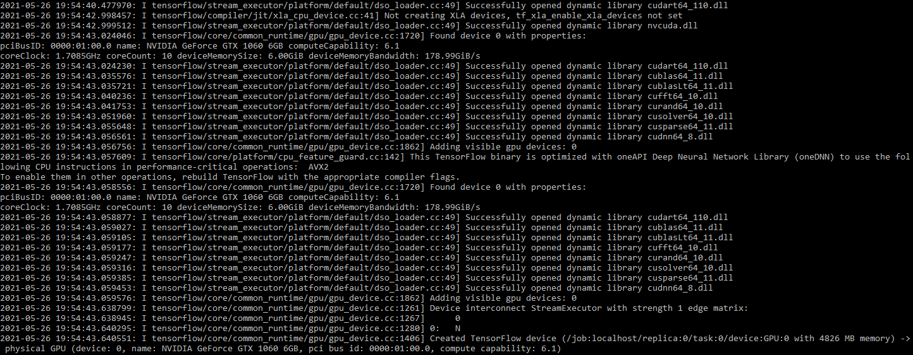

# ScalableCNN
CNN training that can run on Cluster, Single machine or Multi-GPU system such as DGX

To run the code, download and install Python 3.8 or above. This can be found at https://www.python.org/downloads/ and installed on Windows or for Linux:
Linux Terminal
$ sudo apt install python3.8

Once Python is installed, use CMD (Windows) or Terminal (Linux) to install TensorFlow and MatPlotLib:

Windows CMD:

:> pip install tensorflow

:> pip install matplotlib

Linux Terminal:

$ pip install tensorflow

$ pip install matplotlib

Now the library files for Python, cuDNN and CUDA GPU Toolkit are installed, extract the folder from the Zip. 
Inside there is a folder named “CNNtensorflowCKnight” which is the root folder of the project, within this folder is a file named “CNNtensorflowCKnight.py” and a folder named “datasets” which contains the image files required for training and testing.
From CMD/Terminal navigate to the root folder and enter the following command:

Windows CMD:
/ScalableCNN:> CNNtensorflowCKnight.py

Linux Terminal
/ScalableCNN: $ python3 CNNtensorflowCKnight.py

A python environment window will then open, and the program will run automatically until completion. A graph showing the accuracy recorded over the number of Epochs will be saved to the root directory and the trained model will be saved in a new folder named “ModelSave”.
If the program runs correctly, you should see something like Figure 1 where the DLL’s have loaded successfully for CUDA GPU Acceleration and The GPU has been found, any errors will be shown here.

Figure 1 – CUDA GPU Acceleration Successful Launch

Dataset:
The dataset is included in the repository as the code has been designed for offline use.

   Provided by:
Fashion-MNIST: a Novel Image Dataset for Benchmarking Machine Learning Algorithms. Han Xiao, Kashif Rasul, Roland Vollgraf. arXiv:1708.07747
